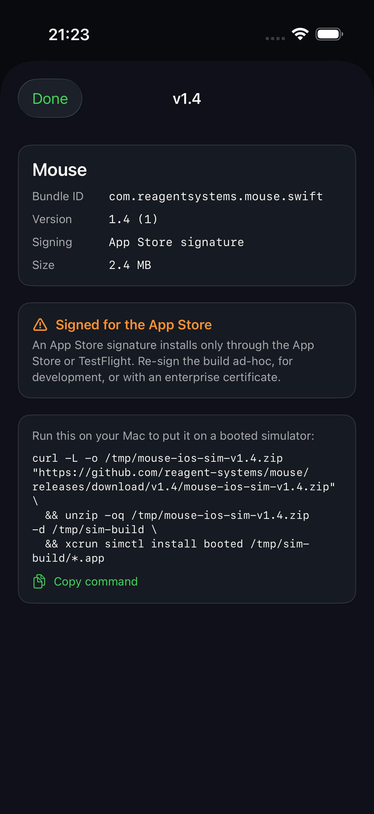

# Apropos

Your GitHub releases, installed on your iPhone. Ship a build to a repo's
Releases page, open Apropos on the phone, tap the repo, run it. No
TestFlight, no cable.



## What it does

- Signs in with GitHub through the OAuth device flow. No client secret, no
  backend. The token stays in the phone's Keychain.
- Lists your repositories, most recently pushed first, with search and pull
  to refresh.
- Marks the repos whose latest release carries an installable iOS build.
- Reads the `.ipa`'s bundle identifier, version, and signature over HTTP
  range requests, so it never downloads the archive to tell you what it is.
- Installs through `itms-services://`, which is the only way iOS lets an app
  install another app.
- Names the reason when it cannot install: no `.ipa`, a simulator-only
  build, a private release asset, an App Store signature, or no manifest
  host.

## Run it

```sh
brew install xcodegen
cd ios && xcodegen generate && open Apropos.xcodeproj
```

Then follow [docs/DEPLOY-TO-PHONE.md](docs/DEPLOY-TO-PHONE.md) to sign it
with your team and put it on your iPhone.

## Health gate

```sh
verify/verify.sh
```

Regenerates the project, builds with source warnings treated as errors,
runs the unit tests, installs and launches the app on a booted simulator,
then drives the real UI against live GitHub and refreshes
`docs/screenshots/`. The steps that need a GitHub token print `SKIP` and
the reason when there is none.

## Layout

| Path | What it is |
|---|---|
| `ios/` | The iPhone app. `ios/project.yml` is the project source of truth. |
| `verify/` | The health gate, one script per check. |
| `src/` | A Next.js app. It hosts `/api/manifest` for repositories you cannot write to, and a browser demo of the idea. |
| `agent-kit/` | The process this repository is built under. Start at `agent-kit/ROUTING.md`. |
| `docs/` | Architecture, configuration, deployment, and the screenshots the gate regenerates. |

## The web surface

`src/` predates the iOS app and stays as a browser demo. Its one load-bearing
part is `src/app/api/manifest`, which turns query values into the install
manifest iOS reads.

```sh
npm install && npm run dev
```
